# 🍽️ TableSetter

### Restaurant Management & Customer Insights Platform

---

## 🌐 Deployment

| Service | Link |
|---|---|
| 🎨 Frontend (Vercel) | https://tablesetter.vercel.app/ |
| ⚙️ Backend API (Railway) | https://tablesetter-production.up.railway.app/api/restaurants |
| Database (Railway) | Postgres DB |

## 📸 Screenshots & Demo

**[Screenshots & Demo](#-screenshots--demo-1)** a walkthrough of the app.

---

## 📖 Table of Contents

- 🌐 [Deployment](#-deployment)
- 📸 [Screenshots & Demo](#-screenshots--demo)
- 🌟 [Overview](#-overview)
- 🛠️ [Tech Stack](#️-tech-stack)
- 🏗️ [System Architecture](#️-system-architecture)
- 🔄 [Request Flow](#-request-flow)
- 🔎 [Restaurant Discovery Flow](#-restaurant-discovery-flow)
- 🧩 [Data Model (Class Diagram)](#-data-model-class-diagram)
- 🔗 [Entity Relationships](#-entity-relationships)
- ✅ [Feature Set](#-feature-set)
- 📡 [API Reference](#-api-reference)
- 📁 [Project Structure](#-project-structure)
- 🚀 [Getting Started](#-getting-started)
- 🚫 [Out of Scope](#-out-of-scope)
- 📸 [Screenshots & Demo (full)](#-screenshots--demo-1)

---

## 🌟 Overview

| 👤 Role | What they can do |
|---|---|
| 🏪 **Owner** | Register a restaurant, manage menu categories & items, reply to reviews |
| 🙋 **Customer** | Discover restaurants, search by cuisine/dish, leave ratings & reviews, log dining expenses |
| 🔎 **Search** | Typo-tolerant restaurant & menu search, powered by Typesense |
| 📊 **Insights** | Monthly dining-spend summary, delivered straight to the inbox |

---

## 🛠️ Tech Stack

### 🎨 Frontend — `my-phoenix`

- ⚛️ React 19.x
- ▲ Next.js 16.x (App Router)
- 🔷 TypeScript 5.x
- 🐜 Ant Design (AntD) 5.x
- 🔄 TanStack React Query 5.x
- 📡 Axios
- 🧱 Atomic Design structure — `atoms/` `icons/` `molecules/` `organisms/` `templates/`
- ☁️ Deploy: Vercel

### ⚙️ Backend — `my-toblerone`

- 🐘 Laravel (PHP 8.2)
- 🐳 Laravel Sail (Docker dev environment)
- 🔐 Laravel Sanctum (authentication)
- 🔍 Laravel Scout (search abstraction)

### 🗄️ Database / Infrastructure

- 🐘 PostgreSQL — primary relational database
- 🔎 Typesense — search engine (via Laravel Scout)

### 🧰 Dev / Debug Tools

| Tool | Purpose |
|---|---|
| 🧪 Laravel Tinker | Interactive REPL |
| 🔭 Laravel Telescope | Request / query / exception inspector |
| 📮 Postman | API testing |

---

## 🏗️ System Architecture

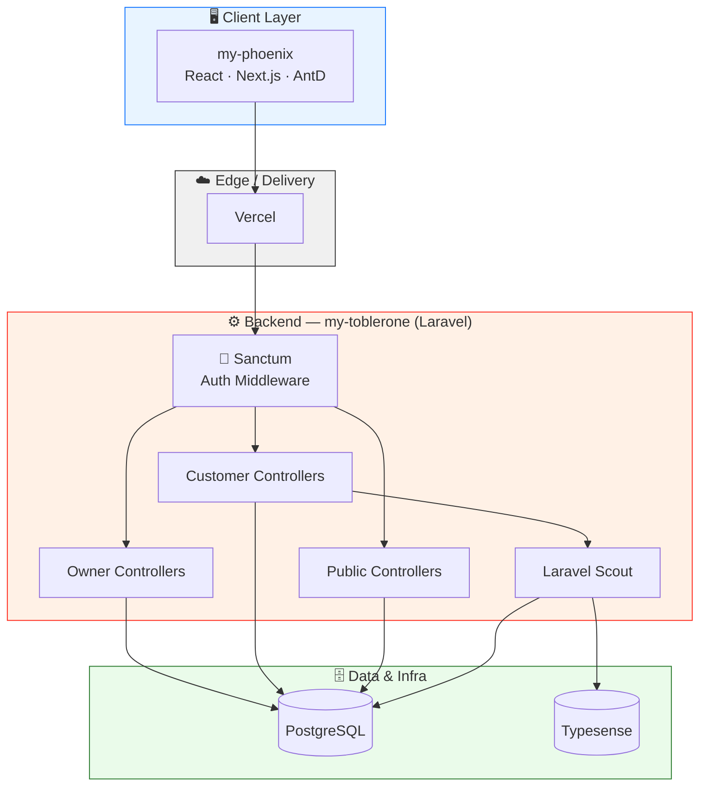

---

## 🔄 Request Flow

Example: a customer submitting a restaurant review, end to end.

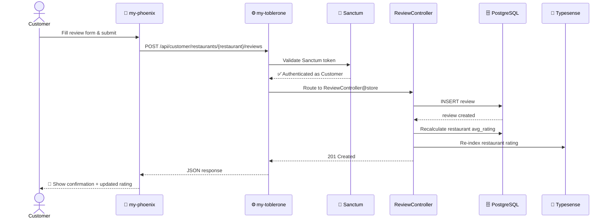

---

## 🔎 Restaurant Discovery Flow

```mermaid
flowchart LR
    U(["🧑 Customer"]) --> Q["🔍 Search bar<br/>name · cuisine · dish"]
    Q --> API["GET /api/search/restaurants"]
    API --> Scout["Laravel Scout"]
    Scout --> TS[("Typesense Index")]
    TS --> Results["Typo-tolerant<br/>partial-match results"]
    Results --> Filter["🎚️ Filter by<br/>price range & rating"]
    Filter --> List["📋 Paginated<br/>restaurant listing"]
    List --> Detail["GET /api/restaurants/{restaurant}<br/>Profile + Menu"]

    style U fill:#e8f4ff,stroke:#1677ff
    style TS fill:#f5f5f5,stroke:#333
    style Detail fill:#fff1e6,stroke:#ff2d20
```

---

## 🧩 Data Model (Class Diagram)

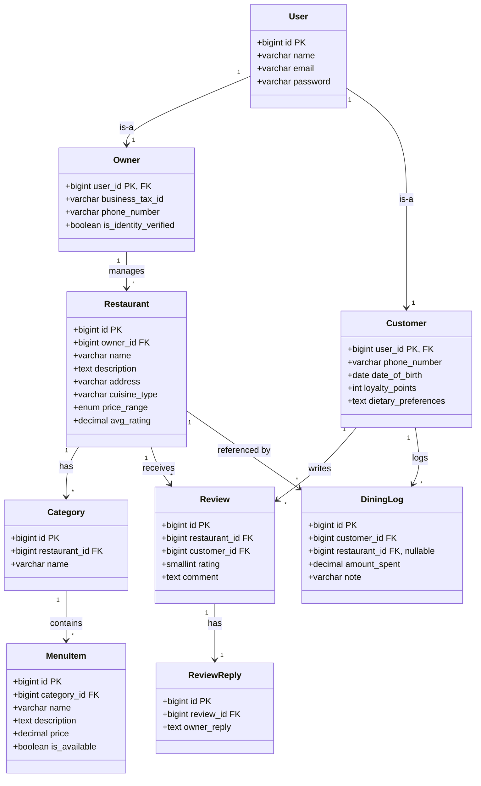

---

## 🔗 Entity Relationships

| Relationship | Cardinality | Notes |
|---|:---:|---|
| `users` → `owners` | 1 : 1 | Table inheritance via shared PK/FK on `user_id` |
| `users` → `customers` | 1 : 1 | Table inheritance via shared PK/FK on `user_id` |
| `owners` → `restaurants` | 1 : ∗ | An owner can manage multiple restaurants |
| `restaurants` → `categories` | 1 : ∗ | Menu is organized into categories |
| `categories` → `menu_items` | 1 : ∗ | Each category holds multiple items |
| `restaurants` → `reviews` | 1 : ∗ | Reviews are tied to one restaurant |
| `customers` → `reviews` | 1 : ∗ | A customer can write many reviews |
| `reviews` → `review_replies` | 1 : 1 | Owner reply per review |
| `customers` → `dining_logs` | 1 : ∗ | Personal expense entries |
| `restaurants` → `dining_logs` | 1 : ∗ (nullable) | Logs can exist without a linked restaurant |

---

## ✅ Feature Set

### 🔐 FR-1 · Authentication & Authorization
- Register as Owner or Customer
- Login / logout via Laravel Sanctum
- Role-based access to protected endpoints

### 🏪 FR-2 · Restaurant Management *(Owner)*
- Create, update, delete restaurant profile
- View list of owned restaurants

### 📋 FR-3 · Menu Management *(Owner)*
- Create and manage menu categories
- Add, edit, delete menu items — name, price, availability

### 🔎 FR-4 · Restaurant Discovery *(Customer)*
- Browse paginated restaurant listings
- Search by name, cuisine, or dish
- Filter by price range and rating
- View restaurant profile and full menu

### ⭐ FR-5 · Reviews & Ratings
- Submit rating and written review
- Edit or delete own review
- Average rating auto-calculated per restaurant
- Owner can reply to reviews and is notified of new ones

### 💰 FR-6 · Dining Budget Tracker *(Customer)*
- Log dining expense entries — restaurant, amount, date, notes
- View monthly dining expense summary

### ⚡ FR-7 · Search Infrastructure
- Restaurant and menu data indexed via Typesense/Scout
- Typo-tolerant, partial-match search

---

## 📡 API Reference

### 🔐 Auth

| Method | Endpoint | Description |
|:---:|---|---|
| `POST` | `/api/customer/register` | Register a new customer |
| `POST` | `/api/customer/login` | Customer login |
| `POST` | `/api/customer/logout` | Customer logout |
| `GET` | `/api/customer/me` | Current customer |
| `POST` | `/api/owner/register` | Register a new owner |
| `POST` | `/api/owner/login` | Owner login |
| `POST` | `/api/owner/logout` | Owner logout |
| `GET` | `/api/owner/me` | Current owner |

### 🙋 Customer

| Method | Endpoint | Description |
|:---:|---|---|
| `GET` | `/api/customer/profile` | View profile |
| `PUT` | `/api/customer/profile` | Update profile |
| `GET` | `/api/customer/dining-logs` | List dining logs |
| `POST` | `/api/customer/dining-logs` | Create dining log |
| `GET` | `/api/customer/dining-logs/summary` | Monthly spend summary |
| `PUT/PATCH` | `/api/customer/dining-logs/{dining_log}` | Update dining log |
| `DELETE` | `/api/customer/dining-logs/{dining_log}` | Delete dining log |
| `POST` | `/api/customer/restaurants/{restaurant}/reviews` | Submit review |
| `PUT` | `/api/customer/reviews/{review}` | Edit own review |
| `DELETE` | `/api/customer/reviews/{review}` | Delete own review |

### 🏪 Owner

| Method | Endpoint | Description |
|:---:|---|---|
| `GET` | `/api/owner/profile` | View profile |
| `PUT` | `/api/owner/profile` | Update profile |
| `GET` | `/api/owner/restaurants` | List owned restaurants |
| `POST` | `/api/owner/restaurants` | Create restaurant |
| `GET` | `/api/owner/restaurants/{restaurant}` | View restaurant |
| `PUT/PATCH` | `/api/owner/restaurants/{restaurant}` | Update restaurant |
| `DELETE` | `/api/owner/restaurants/{restaurant}` | Delete restaurant |
| `GET` | `/api/owner/restaurants/{restaurant}/categories` | List categories |
| `POST` | `/api/owner/restaurants/{restaurant}/categories` | Create category |
| `PUT` | `/api/owner/categories/{category}` | Update category |
| `DELETE` | `/api/owner/categories/{category}` | Delete category |
| `GET` | `/api/owner/categories/{category}/menu-items` | List menu items |
| `POST` | `/api/owner/categories/{category}/menu-items` | Create menu item |
| `PUT` | `/api/owner/menu-items/{menuItem}` | Update menu item |
| `DELETE` | `/api/owner/menu-items/{menuItem}` | Delete menu item |
| `GET` | `/api/owner/restaurants/{restaurant}/reviews` | List reviews for restaurant |
| `POST` | `/api/owner/reviews/{review}/reply` | Reply to a review |

### 🌍 Public

| Method | Endpoint | Description |
|:---:|---|---|
| `GET` | `/api/restaurants` | Browse restaurants (paginated) |
| `GET` | `/api/restaurants/{restaurant}` | Restaurant profile + menu |
| `GET` | `/api/search/restaurants` | search |

---

## 📁 Project Structure

```
tablesetter/
├── my-phoenix/                  # Frontend — Next.js
└── my-toblerone/                # Backend — Laravel
```

---

## 🚀 Getting Started

### ✅ Prerequisites
- 🐳 Docker (for Laravel Sail)
- 🟢 Node.js 20+
- 🐘 PHP 8.2+ / Composer

### ⚙️ Backend — `my-toblerone`

```bash
cd my-toblerone
cp .env.example .env
./vendor/bin/sail up -d
./vendor/bin/sail artisan migrate --seed
```

### 🎨 Frontend — `my-phoenix`

```bash
cd my-phoenix
npm install
npm run dev
```

### 🧭 Dev Tool URLs

| Tool | URL |
|---|---|
| 🔭 Telescope | `http://localhost/telescope` |
| 🌅 Postman | Collection Given in Root Folder named postman-collection-&testing |

---

## 🚫 Out of Scope

The following are explicitly **not** part of this training project:

- 💳 Real payment gateway integration
- 📍 Geo-based ("near me") location search
- 🍽️ In-app table ordering
- 💱 Multi-currency support

---

## 📸 Screenshots & Demo

### 🏠 Landing / Restaurant Listing
 
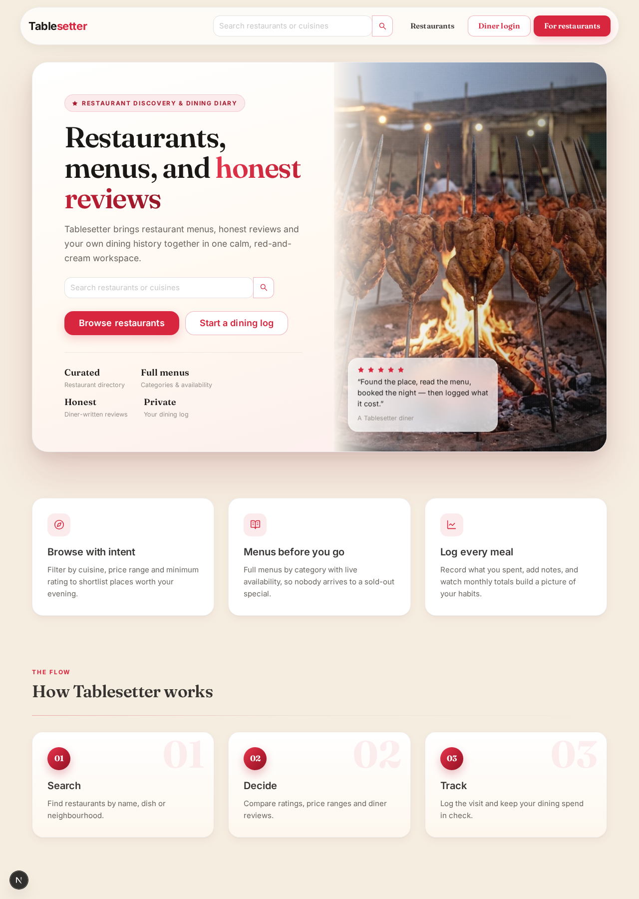

### Login / Signup (Owner/Customer)
 
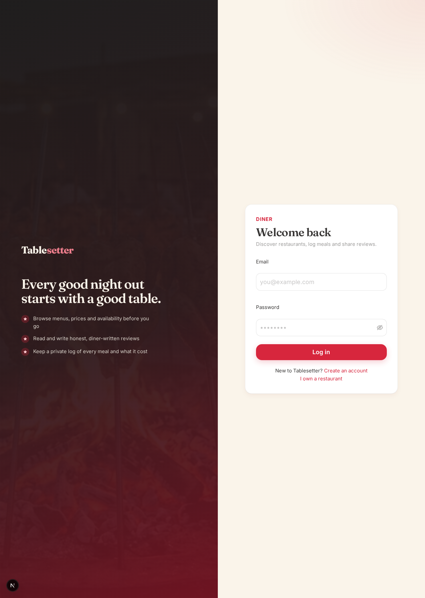

### Restaurant Listing
 
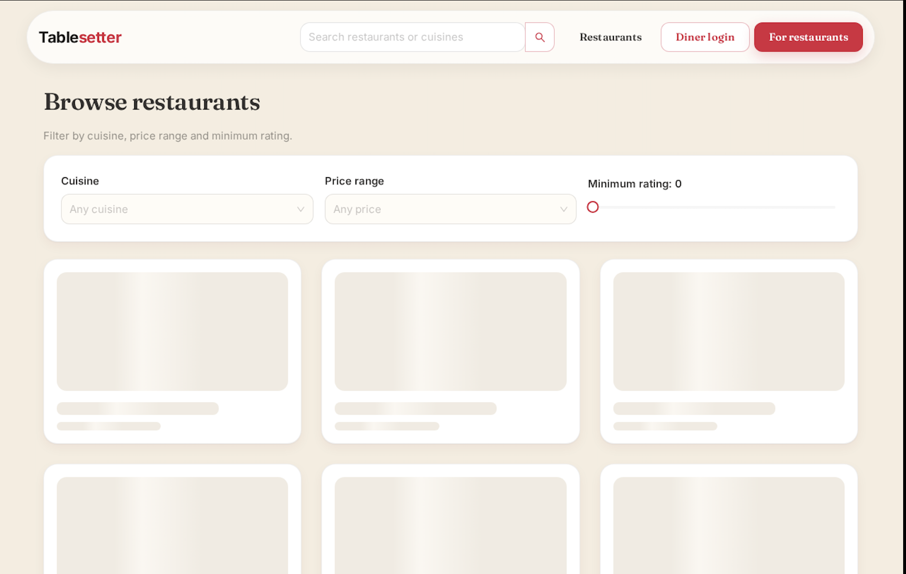

### 🛠️ Owner Dashboard
 
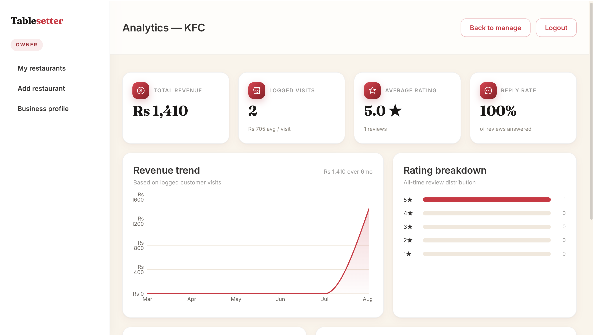

### 🛠️ Customer Dashboard
 
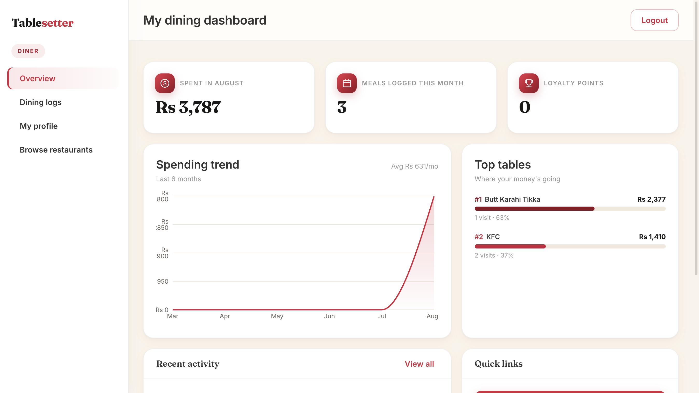

### 🏪 Restaurant Profile & Menu
 
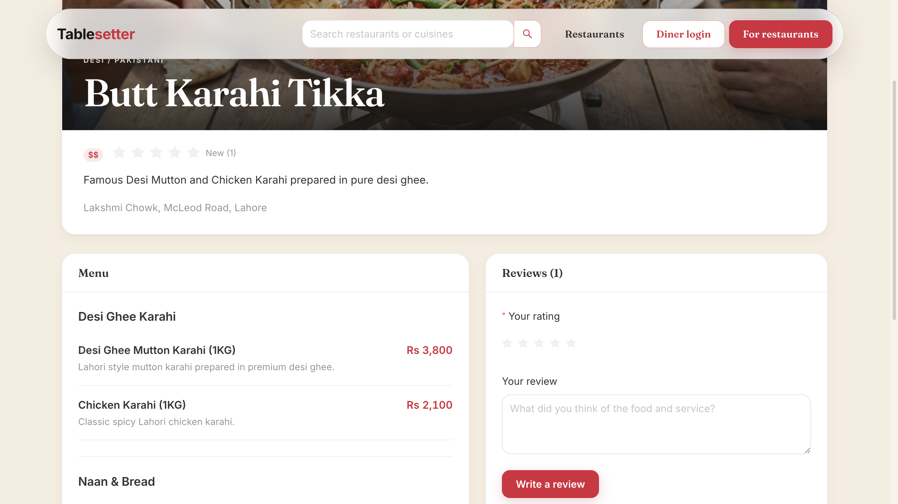

### 💰 Dining Logs
 
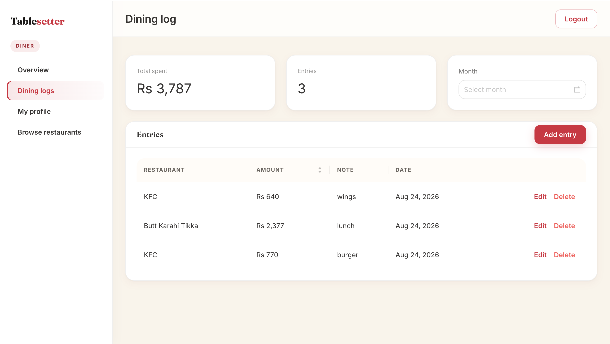

### ⭐ Manage Resturant (Owner)
 
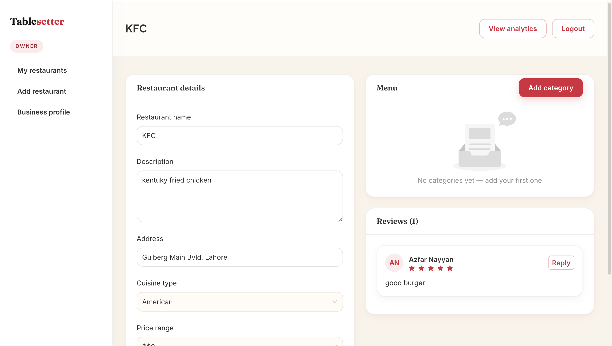
 
### ⭐ Reviews & Ratings
 
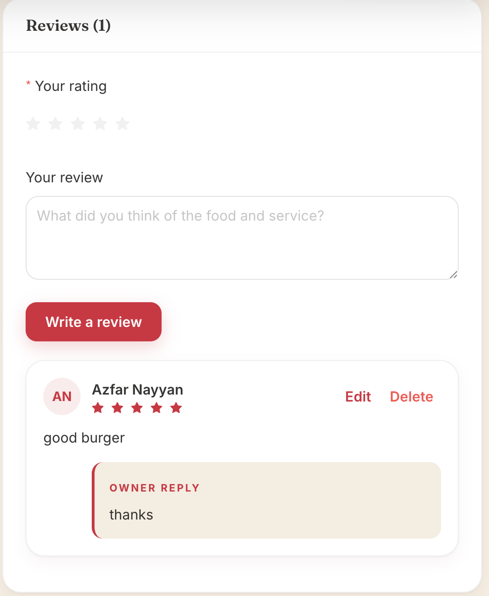
 
 

**[⬆ Back to top](#-tablesetter)**

---

*Training project — Software Requirements Specification by **Azfar Nayyan***
